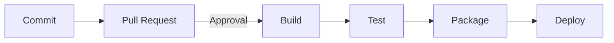

# Overview

Random items not specificaly aligned to any of the other repos, or potentially linked with more than one other repo.

# Other
## Mermaid Graph Sample

## Mermaid Sequence Diagram Sample

For more information see:
- https://github.blog/2022-02-14-include-diagrams-markdown-files-mermaid/
- https://mermaid.js.org/intro/
